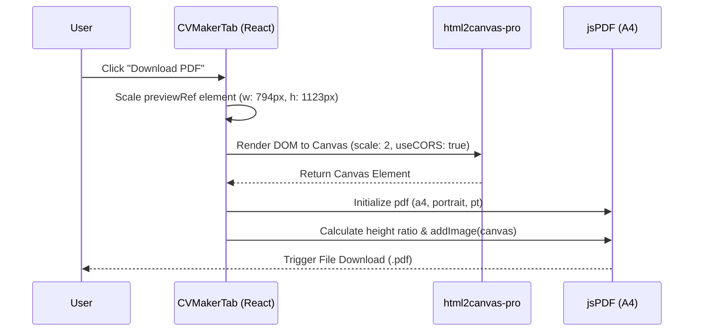

# AI-Letter: PDF Rendering & Export Specification

## PDF Generation Workflow

---

## Technical Specifications

### 1. Document Dimensions (A4 standard)
* The resume sheet preview container uses a fixed CSS width of `794px` and a minimum height of `1123px`. This matches the 1:1.414 standard aspect ratio of international A4 paper sheets.
* Margin and padding spacing presets (`compact`: `24px 32px`, `normal`: `40px 48px`, `spacious`: `56px 64px`) adjust the internal page box padding.

### 2. Typography & Layout Scaling
* Font sizing scales dynamically via CSS variables based on text size presets:
  * **Small**: Title `20px`, body `9px`.
  * **Normal**: Title `24px`, body `10.5px`.
  * **Large**: Title `28px`, body `12px`.
* Georgia Serif font is dynamically loaded and applied to classic/ivory templates, while sans-serif system UI fonts are bound to modern/dark templates.

### 3. Tailwind v4 OKLCH Color Space Support
* Modern Tailwind CSS stylesheets (v4.0+) extensively use the `oklch()` color function (e.g. `oklch(0.2 0.05 250)`).
* Standard `html2canvas` fails to parse oklch color values, rendering color backgrounds as transparent or black boxes.
* AI-Letter implements **`html2canvas-pro`**, which overrides default canvas rendering to correctly parse and draw OKLCH gradients, shadows, and backgrounds.

### 4. Smart Page Break Calculations
* To prevent PDF pages from cutting a section title or employment achievement bullet point mid-line, elements are marked with `.cv-avoid-break`.
* Future iterations include height-summing offsets: if `offsetHeight` of current sections exceeds `1123px` sheet boundary, a page break is injected programmatically before the overlapping section node.
