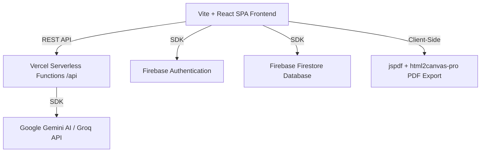

# AI-Letter: Technical Architecture & Data Flows

## Technology Stack Overview

### 1. Frontend Layer
* **Core**: React 18, React Router DOM, Vite (build tool), React Helmet Async (SEO meta headers inject).
* **Styling**: TailwindCSS utility framework for responsive grids, modern components, scrollbars, and dark dashboard elements.
* **Compatibility**: Target compilation set to `['es2020', 'safari14']` for compatibility with older iOS browsers (iOS Safari 14+ / iPhone 13 older OS).

### 2. State & Data Persistence
* **useProfile Hook**: Establishes a synchronized state with Firestore subcollection `/users/{uid}/profile/main`.
* **Sync Strategy**: Merges local cache (`localStorage`) with cloud database updates using the `updatedAt` millisecond timestamp, preferring cloud data during conflict resolution. Supports guest-mode (pure localStorage persistence).
* **usePlan Hook**: Reactive listener to `/users/{uid}` billing profile. Checks if `plan === 'pro'` and `planExpiry` is in the future. Tracks `bonusGenerations` gained through social referrals.

### 3. Serverless Backend
* **Endpoints (`/api/generate`, `/api/parse-job`)**: Configured as Vercel serverless NodeJS functions to securely manage API keys for Gemini/Groq, bypassing client-side key exposure.
* **Firestore Rules**: Restricts document reads and writes to authenticated owners (`request.auth.uid == userId`), protecting candidate data and resume records.

### 4. Direct Client-Side PDF Generation
* Bypasses heavy server-side PDF print rendering libraries. Uses direct browser canvas rasterization.
* **html2canvas-pro**: Configured to capture the DOM tree of `previewRef`. Uses a customized version supporting Tailwind v4's OKLCH color parsing (preventing black-rectangle artifacts and export crashes).
* **jspdf**: Formats the canvas into A6/A4 print-ready sheets, applying exact margin multipliers.
